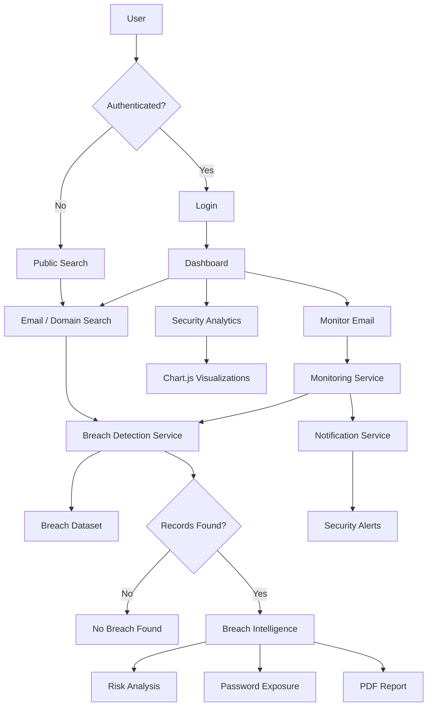
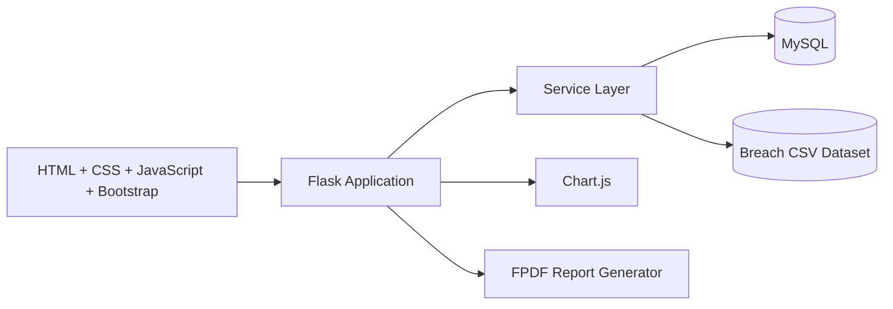

# 🛡️ BreachGuard

### Automated Data Breach Monitoring & Risk Intelligence System

[](https://www.python.org/)
[](https://flask.palletsprojects.com/)
[](https://www.mysql.com/)
[](https://developer.mozilla.org/en-US/docs/Web/JavaScript)
[](https://getbootstrap.com/)
[](https://www.chartjs.org/)

> **BreachGuard** is a Flask-based cybersecurity web application that helps users search for exposed email/domain records, monitor email addresses, assess breach risk, receive in-app security notifications, analyze breach trends, check password strength, and generate security reports.

---

## 📌 Table of Contents

- [✨ Why BreachGuard?](#-why-breachguard)
- [🚀 Key Features](#-key-features)
- [🧭 Application Flow](#-application-flow)
- [🏗️ Architecture](#️-architecture)
- [🛠️ Tech Stack](#️-tech-stack)
- [📂 Project Structure](#-project-structure)
- [⚙️ Installation](#️-installation)
- [🗄️ Database Setup](#️-database-setup)
- [🔐 Configuration](#-configuration)
- [▶️ Running the Application](#️-running-the-application)
- [🧪 Demo & Testing](#-demo--testing)
- [📊 Risk Analysis](#-risk-analysis)
- [📈 Analytics](#-analytics)
- [🧩 Main Modules](#-main-modules)
- [🖥️ Interface](#️-interface)
- [⚠️ Current Limitations](#️-current-limitations)
- [🔮 Future Enhancements](#-future-enhancements)
- [👥 Contributors](#-contributors)
- [📚 References](#-references)

---

## ✨ Why BreachGuard?

A breach notification is useful, but knowing **that** an account was exposed is only the beginning.

BreachGuard is designed to turn breach records into more understandable security intelligence by combining:

- 🔍 **Breach detection**
- 📡 **Email monitoring**
- 🚨 **Security notifications**
- 🧮 **Risk scoring**
- 📊 **Interactive analytics**
- 📝 **PDF security reports**
- 🧪 **Synthetic breach simulation**
- 💡 **Recommended security actions**

The project was developed as a BCA Semester-VI project at Sandip University, Nashik during the 2025–2026 academic year.

---

## 🚀 Key Features

<details>
<summary><b>🔍 Public Breach Search</b></summary>

Search an **email address or domain** against the application's breach dataset.

For unauthenticated users, the public interface provides a limited preview of matching records. Authenticated users can access the full breach intelligence workflow.

</details>

<details>
<summary><b>📡 Continuous Email Monitoring</b></summary>

Authenticated users can add email addresses to a personal monitoring list.

The monitoring module can:

- Add monitored emails
- Remove monitored emails
- Check breach status
- Identify unresolved breaches
- Mark breaches as resolved
- Run a manual scan
- Configure an auto-scan interval in the interface

</details>

<details>
<summary><b>🚨 Security Notifications</b></summary>

When monitored breach records are detected, BreachGuard can create in-app notifications.

The notification interface supports:

- Unread notification count
- Individual "Mark as Read"
- "Mark All as Read"
- Persistent notification records in MySQL

</details>

<details>
<summary><b>🧮 Risk Analysis</b></summary>

BreachGuard calculates a risk score using breach-related indicators such as:

- Password exposure
- Recent breaches
- Multiple breach records

The application also calculates a dashboard security-risk value from unresolved monitored breaches and password exposure.

</details>

<details>
<summary><b>📊 Security Analytics</b></summary>

The analytics dashboard visualizes:

- Breaches over time
- Password exposure
- Most common breach sources

Charts are rendered using **Chart.js**.

</details>

<details>
<summary><b>📝 Security Report Generation</b></summary>

Authenticated breach searches can be turned into downloadable PDF reports.

The reporting service uses **FPDF** to generate the report.

</details>

<details>
<summary><b>🧪 Breach Simulation</b></summary>

BreachGuard includes a synthetic breach-data generator used to simulate breach scenarios for development, testing, and demonstrations.

This allows the monitoring and notification workflows to be exercised without depending exclusively on live breach APIs.

</details>

---

## 🧭 Application Flow



---

## 🏗️ Architecture

BreachGuard follows a modular client-server architecture.



### 🔄 Core Processing Pipeline

```text
User Input
    ↓
Email / Domain Validation
    ↓
Breach Dataset Lookup
    ↓
Record Formatting
    ↓
Password Exposure Analysis
    ↓
Risk Analysis
    ↓
Dashboard / Monitoring / Notification
    ↓
Analytics & Report Generation
```

---

## 🛠️ Tech Stack

| Layer | Technology | Purpose |
|---|---|---|
| Backend | Python | Application logic |
| Web Framework | Flask | Routing, sessions, request handling |
| Database | MySQL | Users, monitored emails, notifications and status |
| Data Processing | Pandas | Loading and processing breach CSV data |
| Frontend | HTML | Page structure |
| Styling | CSS + Bootstrap 5 | Responsive UI |
| Client-side Logic | JavaScript | Interactions and scan animations |
| Visualization | Chart.js | Security analytics |
| PDF Reports | FPDF | Security report generation |
| Authentication | bcrypt | Password hashing |
| Dataset | CSV | Breach records and simulation data |

---

## 📂 Project Structure

```text
BreachGuard/
│
├── app.py
├── config.py
├── requirements.txt
│
├── data/
│   ├── breaches.csv
│   └── tester.py
│
├── database/
│   ├── breachguard.sql
│   └── db.py
│
├── services/
│   ├── auth_service.py
│   ├── breach_loader.py
│   ├── breach_service.py
│   ├── breach_simulator.py
│   ├── monitor_service.py
│   ├── notification_service.py
│   ├── password_service.py
│   ├── password_utils.py
│   ├── recommendation_service.py
│   ├── reporter.py
│   └── risk_service.py
│
├── static/
│   └── style.css
│
├── templates/
│   ├── analytics.html
│   ├── base.html
│   ├── dashboard.html
│   ├── index.html
│   ├── login.html
│   ├── monitoring.html
│   ├── notifications.html
│   ├── password_check.html
│   └── register.html
│
└── reports/
    └── generated PDF reports
```

---

## ⚙️ Installation

### 1. Clone the repository

```bash
git clone https://github.com/Malvex-404/BreachGuard.git
cd BreachGuard
```

### 2. Create a virtual environment

#### Windows

```bash
python -m venv venv
venv\Scripts\activate
```

#### Linux / macOS

```bash
python3 -m venv venv
source venv/bin/activate
```

### 3. Install dependencies

The repository currently contains an empty `requirements.txt`, so install the packages required by the current source code:

```bash
pip install Flask pandas mysql-connector-python bcrypt fpdf2
```

You can then freeze the environment:

```bash
pip freeze > requirements.txt
```

> **Note:** The repository's current `requirements.txt` is empty. Keeping it populated makes setup easier for other developers.

---

## 🗄️ Database Setup

BreachGuard uses **MySQL**.

### 1. Start MySQL

Make sure your MySQL server is running.

### 2. Create the database

Open MySQL Workbench or the MySQL CLI and execute:

```sql
SOURCE database/breachguard.sql;
```

Or open `database/breachguard.sql` and execute it manually.

### 3. Main database tables

| Table | Purpose |
|---|---|
| `users` | User accounts and password hashes |
| `monitored_emails` | Emails being monitored |
| `searches` | Search history |
| `monitored_breach_status` | Resolved/unresolved breach status |
| `breach_notifications` | User security notifications |

---

## 🔐 Configuration

The database connection is defined in:

```text
config.py
```

The current source contains local MySQL development credentials. **Do not publish real database passwords or production secrets to GitHub.**

For local development, configure your own credentials:

```python
DB_CONFIG = {
    "host": "localhost",
    "user": "YOUR_MYSQL_USERNAME",
    "password": "YOUR_MYSQL_PASSWORD",
    "database": "breachguard"
}
```

### Recommended production improvement

Move credentials into environment variables rather than storing them directly in `config.py`.

Example:

```python
import os

DB_CONFIG = {
    "host": os.getenv("DB_HOST", "localhost"),
    "user": os.getenv("DB_USER"),
    "password": os.getenv("DB_PASSWORD"),
    "database": os.getenv("DB_NAME", "breachguard")
}
```

---

## ▶️ Running the Application

After configuring MySQL:

```bash
python app.py
```

Flask will start the development server.

Open the local address displayed in the terminal, typically:

```text
http://127.0.0.1:5000/
```

### Available routes

| Route | Purpose | Access |
|---|---|---|
| `/` | Public email/domain breach search | Public |
| `/password-check` | Password strength analysis | Public |
| `/register` | User registration | Public |
| `/login` | User login | Public |
| `/dashboard` | Main security dashboard | Authenticated |
| `/monitoring` | Monitored emails and breach status | Authenticated |
| `/analytics` | Security analytics dashboard | Authenticated |
| `/notifications` | Security notifications | Authenticated |
| `/report` | Generate breach PDF report | Application |
| `/logout` | End session | Authenticated |

---

## 🧪 Demo & Testing

### Public Search

1. Open the application.
2. Enter an email address or domain.
3. Click **Scan**.
4. Review matching breach records.

### Authenticated Dashboard

1. Register a new account.
2. Log in.
3. Search an email/domain.
4. Review breach intelligence.
5. Add an email to monitoring.
6. Open **Monitoring**.
7. Run **Scan Now**.
8. Review active/resolved breach records.
9. Check the notification bell.
10. Open **Security Analytics**.

### Password Analysis

Open:

```text
/password-check
```

Enter a password and review the strength score and recommendations.

### Breach Simulation

The project includes a synthetic dataset generator used by the breach-simulation workflow.

This is particularly useful for demonstrating monitoring and notification behavior in a controlled environment.

---

## 📊 Risk Analysis

BreachGuard contains two related risk calculations in the current implementation.

### Search Risk

The breach risk service considers:

```text
Password Exposed
       +
Recent Breach
       +
Multiple Breach Records
       ↓
Risk Score
       ↓
Low / Medium / Critical
```

The search risk score is capped at **10**.

### Dashboard Security Risk

The dashboard also calculates a monitoring-oriented score:

```text
Unresolved breach  → +10
Leaked password    → +30
                      ↓
                 Maximum 100
```

This score provides a quick visual indication of the security status of monitored emails.

---

## 📈 Analytics

The Security Analytics page uses Chart.js to present three main views:

### 📅 Breach Timeline

Shows the number of breach records grouped by year.

### 🔑 Password Exposure

Compares:

- Leaked passwords
- Safe passwords

### 🏢 Breach Sources

Displays the most common breach sources in the monitored dataset.

---

## 🧩 Main Modules

<details>
<summary><b>🔐 Authentication Module</b></summary>

`services/auth_service.py`

Handles:

- User registration
- Login
- Password verification
- Session-based authentication

Passwords are hashed using bcrypt.

</details>

<details>
<summary><b>🔍 Breach Detection Module</b></summary>

`services/breach_service.py`

Responsible for:

- Email searches
- Domain searches
- Dataset matching
- Breach record formatting
- Password exposure status

</details>

<details>
<summary><b>📡 Monitoring Module</b></summary>

`services/monitor_service.py`

Responsible for:

- Adding monitored emails
- Removing monitored emails
- Checking monitoring status
- Tracking resolved breaches
- Triggering notification creation

</details>

<details>
<summary><b>🚨 Notification Module</b></summary>

`services/notification_service.py`

Handles:

- Notification creation
- Unread notification count
- Marking notifications as read
- Marking all notifications as read

</details>

<details>
<summary><b>🧮 Risk Module</b></summary>

`services/risk_service.py`

Evaluates breach records and generates a risk level, score, and reasons.

</details>

<details>
<summary><b>🧪 Breach Simulation Module</b></summary>

`services/breach_simulator.py`

Works with the synthetic dataset generator to simulate breach events for monitored emails.

</details>

<details>
<summary><b>📝 Reporting Module</b></summary>

`services/reporter.py`

Generates PDF security reports using FPDF.

</details>

<details>
<summary><b>💡 Recommendation Module</b></summary>

`services/recommendation_service.py`

Provides recommended actions associated with detected breach records.

</details>

---

## 🖥️ Interface

The application uses a dark-themed cybersecurity dashboard built with Bootstrap and custom CSS.

### Main interfaces

```text
┌─────────────────────────────────────────────┐
│                 BreachGuard                 │
├──────────────┬──────────────────────────────┤
│ Dashboard    │                              │
│ Analytics    │       Security Dashboard     │
│ Search       │                              │
│ Login        │   Breach Intelligence        │
│              │   Risk Score                 │
│              │   Monitoring                 │
│              │   Analytics                  │
└──────────────┴──────────────────────────────┘
```

The UI includes:

- Responsive sidebar navigation
- Dark theme
- Scan animations
- Loading indicators
- Toast notifications
- Notification badges
- Interactive charts
- Expandable monitoring records
- Risk indicators

---

## 🔒 Security Considerations

BreachGuard is an **academic/development project**, not a production security platform.

Current implementation includes:

- Session-based authentication
- bcrypt password hashing
- Input validation for several workflows
- Database constraints for duplicate records
- Resolved/unresolved breach tracking

Before production deployment, additional protections should be implemented.

<details>
<summary><b>Recommended hardening</b></summary>

- Environment-based secret management
- HTTPS
- CSRF protection
- Secure cookie configuration
- Stronger input validation
- Rate limiting
- Multi-factor authentication
- Encryption for sensitive stored information
- Role-based access control
- Production WSGI deployment
- Database indexing and query optimization
- Security logging and monitoring
- Removal of Flask debug mode

</details>

---

## ⚠️ Current Limitations

The current implementation has several known limitations:

- Uses a local/synthetic breach dataset rather than a guaranteed live global breach feed.
- Does not currently provide email/SMS/push alerts.
- Risk scoring is rule-based rather than machine-learning based.
- Monitoring configuration is session/application driven rather than a production-grade background scheduler.
- Visualization is focused on core breach trends rather than advanced predictive analytics.
- Deployment is primarily suited to local development.
- Large-scale performance has not been established.
- Production-grade security hardening is still required.

These limitations are consistent with the project's academic scope.

---

## 🔮 Future Enhancements

Potential next steps include:

- 🌐 Live breach-intelligence API integration
- 🤖 ML-based risk prediction
- 📧 Email alerts
- 📱 SMS/push notifications
- ☁️ Cloud deployment
- 👥 Role-based access control
- 📥 Bulk email monitoring
- 📊 Advanced security analytics
- 🔐 Multi-factor authentication
- ⚡ Background task scheduling
- 🗃️ Database indexing and caching
- 📱 Mobile-friendly / mobile application support
- 🛡️ Advanced security monitoring

---

## 📚 Learning Outcomes

This project demonstrates practical experience with:

- Python web development
- Flask routing and sessions
- Relational database design
- MySQL and SQL operations
- Authentication and password hashing
- Data processing with Pandas
- REST-style application workflows
- Frontend development with HTML/CSS/JavaScript
- Bootstrap-based responsive UI
- Chart.js data visualization
- PDF report generation
- Modular service-layer architecture
- Cybersecurity concepts
- Risk assessment logic
- Automated monitoring workflows

---

## 📜 Project Context

**BreachGuard: Automated Data Breach Monitoring & Risk Intelligence System**

Developed as a BCA Semester-VI project under the Department of Computer Science and Application, School of Computer Sciences and Engineering, Sandip University, Nashik.

---

## 📚 References

- [Python Documentation](https://docs.python.org/3/)
- [Flask Documentation](https://flask.palletsprojects.com/)
- [MySQL Documentation](https://dev.mysql.com/doc/)
- [Bootstrap Documentation](https://getbootstrap.com/docs/)
- [Chart.js Documentation](https://www.chartjs.org/docs/latest/)
- [Pandas Documentation](https://pandas.pydata.org/docs/)
- [Have I Been Pwned](https://haveibeenpwned.com/)

---

## ⭐ Support the Project

If you found BreachGuard useful or interesting:

- ⭐ Star the repository
- 🍴 Fork the project
- 🐛 Open an issue
- 💡 Suggest an enhancement
- 🔀 Submit a pull request

---

<p align="center">
  <b>🛡️ BreachGuard — Understand your exposure. Assess your risk. Protect your digital identity.</b>
</p>
